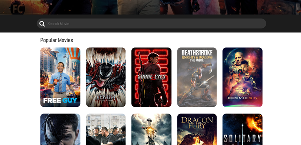
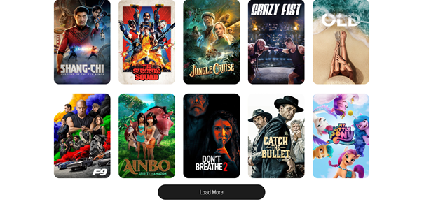
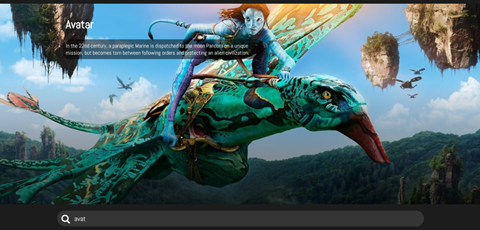
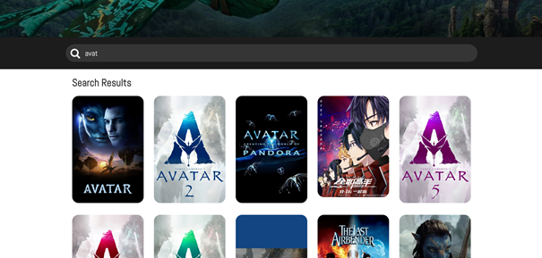
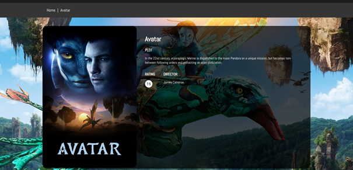
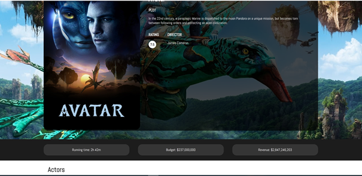
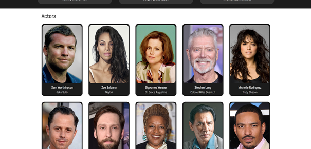
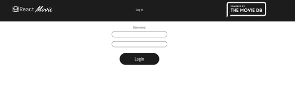
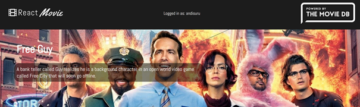
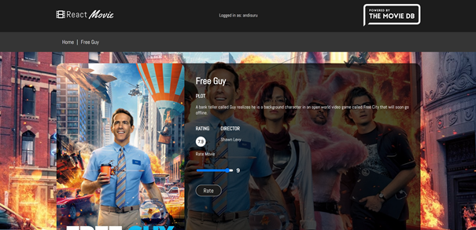

# The Movie App Gallery

This is the gallery for the Movie App created in React which presents images from the project showcasing different pieces of functionality and aspects of the project.
## Home page
#### Top banner - Logos - Login button - Movie backdrop - Movie title - Movie description 

#### Search bar - Popular Movies - Grid view - Movie posters - Clickable cards 

#### Loag more feature - Load more button 

## Search feature
#### Search bar - Search result - Movie backdrop, title, description

#### Search bar - Search results - Grid view - Movie posters - Clickable cards 

## Movie page
#### Bread crumb - Home button link - Movie backdrop, title, description - Movie rating, directors

#### Running time - Budget - Revenue

#### List of Actors - Name - Role

## Login feature
#### Login page

#### Home page - User name

## Rate feature
#### Rate slider - Rate button

