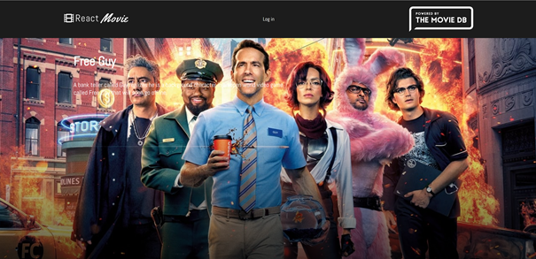
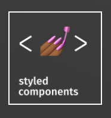

# React Movie App -- Powered by The Movie Database API

<p align="center">
    
</p>

This project cosists of a **React** app ⚛️ Which has as a theme, *The Movie Database API*
and displays a list of popular movies 🎥 and information about each individual movie. The
information is displayed in a new page after clicking on the poster, from the grid, 
corresponding to that specific movie. The app makes the use of modern 
**Functional components** and **React hooks**, and it uses **styled components** 💅 
for handling the styles. The project uses the **React Context API** for storing the 
user in a global state accessible for all the components that are part of the created 
context. The application also uses the **React Router** for managing the routes inside of
the application. The project is deployed on **Netlify**, and it integrates a **CI/CD** 
pipeline for automatic inegration and automatic deployment to Netlify for ease of 
development. The deployment checks run when creating a pull requestor when commiting 
directly to the *main* branch. The project contains a branch called *class-components* 
which represents, as the name suggests, a version of the project written with the 
*"classical"* **React class-components**. 

<br>

# Demo

The project is online:

<h3>

[LIVE DEMO HERE ](https://movie-app9.netlify.app/)

<br>

# Features

* Search functionality 🔍
* Login functionality using personal The Movie Database account credentials 🔐
* Movie rating functionality once logged in into an account ⭐
* Displaying the movie posters in a Grid view 
* Button for loading more movies on the home page and a loading *Spinner* for the 
    loading state :
* Each movie poster is clickable and opens a new page with details about the movie
* The details about the movie are retrieved from the MovieDB API using react hooks
* Displaying a list of Actors in the movie page 🎭
* Transitioning effects on loading the Movie page 
* Hover effects on movie posters buttons  
* Responsive design for mobile devices 📱

<br>

# Technologies used :
<br>
<h2> 

* React &nbsp;&nbsp;&nbsp;&nbsp;&nbsp;&nbsp;&nbsp;&nbsp;&nbsp;&nbsp;&nbsp;&nbsp;&nbsp;&nbsp;&nbsp;&nbsp;&nbsp;&nbsp;&nbsp;&nbsp;&nbsp;&nbsp;&nbsp;&nbsp;&nbsp;&nbsp;&nbsp;&nbsp;&nbsp;&nbsp; 
* The Movie Database API  
* Netlify &nbsp;&nbsp;&nbsp;&nbsp;&nbsp;&nbsp;&nbsp;&nbsp;&nbsp;&nbsp;&nbsp;&nbsp;&nbsp;&nbsp;&nbsp;&nbsp;&nbsp;&nbsp;&nbsp;&nbsp;&nbsp;&nbsp;&nbsp;&nbsp;&nbsp;&nbsp;&nbsp;&nbsp; 
* Styled components &nbsp;&nbsp;&nbsp;&nbsp;&nbsp;&nbsp;&nbsp;&nbsp; 

<br>

# Gallery

Click the image bellow to access the Gallery

[](./GALLERY.md)

<br>

# CI/CD

In the beginning the first deployment was unsuccesful due to an error 


The error was caused by an un-used variable and it was fixed using an `eslint no-used-vars` comment rule

After the fix all the checks from the automatic deployment on Netlify have passed and the site went live


Now when creating a pull request on the main branch or when commiting directly on the main branch,
 the automatic deployment rules execute and run the checks for the new build.


<br>

# To run the project locally

## Pre-requisites:
- node installed (e.g. version used: v14.15.1)
- npm installed (e.g. version used: 6.14.8)

## Steps:

1. Clone the repository
2. Open the command line in the project folder.
3. From the command line write the following comands in order:
```
npm i
npm start
```
4. If port 3000 is not in use, then the React app will start at:
- http://localhost:3000

### Have fun with project and thank you for your attention. :blush: :wink:
